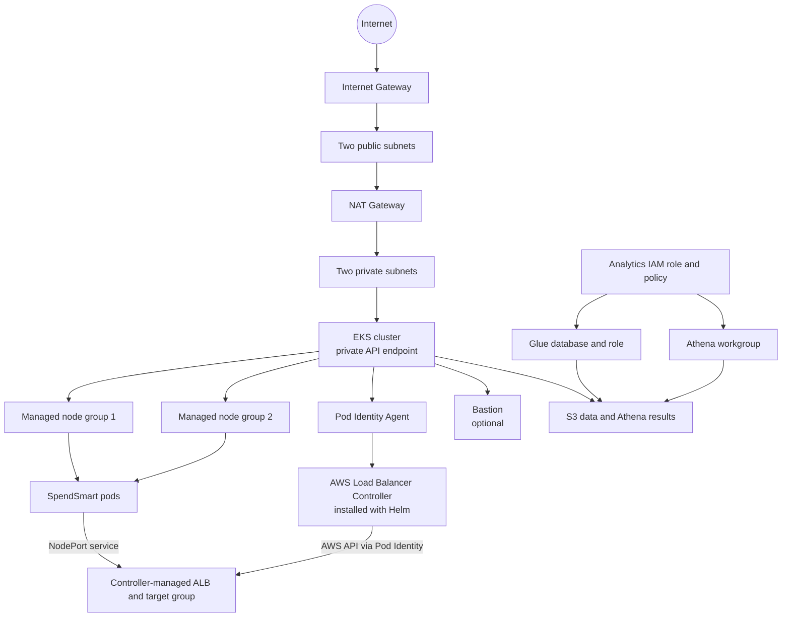

# SpendSmart CloudFormation Architecture

## Purpose and Ownership

The modular CloudFormation root stack provisions AWS infrastructure through nested templates under `modules/`. When enabled, the SpendSmart nested module uses a private deployment host to install the AWS Load Balancer Controller and application chart.

The AWS Load Balancer Controller owns the application ALB and target group. It registers worker-node instances through the frontend NodePort Service and reconciles membership as nodes change.

## Module Layout

| Template | Resources |
| --- | --- |
| `modules/network-skeleton/template.yaml` | VPC, subnets, internet gateway, routes, one NAT gateway/EIP |
| `modules/bastion/template.yaml` | Optional bastion security group, EC2 instance, and EIP |
| `modules/eks/template.yaml` | EKS cluster, multi-AZ node groups, IAM roles, node security group, add-ons, and controller identity |
| `modules/spendsmart/template.yaml` | Optional private deployment host, EKS deployment access, Helm releases, and frontend Ingress |
| `modules/s3/template.yaml` | Data and Athena-results bucket |
| `modules/glue/template.yaml` | Glue database and service role |
| `modules/athena/template.yaml` | Athena workgroup |
| `modules/iam/template.yaml` | Analytics role and policy |

`main.yml` is the deployment entrypoint. Run `aws cloudformation package` to upload the child templates and generate the deployable parent template. `template.yaml` is retained as the monolithic reference.

## Architecture

### CloudFormation-managed resources

- Network: VPC, two public and two private subnets, internet gateway, public routing, one NAT gateway/EIP, and shared private routing.
- Access: optional bastion security group, EC2 instance, and optional Elastic IP.
- EKS: cluster, cluster/node roles, worker security group, two managed node groups eligible in both private subnets, and the `vpc-cni`, `kube-proxy`, `coredns`, and `eks-pod-identity-agent` add-ons.
- Controller identity: IAM role with the AWS Load Balancer Controller permissions policy and an EKS Pod Identity association for the configured Kubernetes namespace/service account.
- Optional application install: private Helm deployment host and an EKS access entry used to install the controller, application chart, and Ingress.
- Data and analytics: retained S3 bucket, Glue database/role, Athena workgroup, and analytics IAM role/managed policy.

### Helm/Kubernetes-managed resources

- AWS Load Balancer Controller Deployment and service account. Pod Identity supplies AWS credentials; do not put AWS access keys in chart values or Kubernetes Secrets.
- SpendSmart Deployments, Services, and refresh CronJob from the application chart, plus a frontend Ingress applied by the deployment module.
- The Ingress uses `target-type: instance`; the frontend Service is changed to NodePort, and the controller registers eligible EC2 worker instances in its managed target group.

Application deployment is disabled by default. Before enabling it, create the `spendsmart` namespace and the chart's image-pull/application Secrets. The deployment role is cluster-admin scoped while the private host installs the controller's cluster-level RBAC and application resources.

## ALB Responsibilities

The controller creates the ALB, listener, security groups, and target group from the Ingress. There is no separate CloudFormation-managed ALB with an unattached target group. The Ingress `ADDRESS` contains the application ALB DNS name after reconciliation.

## CloudFormation Outputs

CloudFormation outputs are strings. Values representing Terraform maps/lists are JSON-encoded strings; conditional bastion outputs are absent when `BastionEnabled` is false.

| Output key | Value |
| --- | --- |
| `VpcId` | VPC ID |
| `VpcCidr` | VPC CIDR |
| `PublicSubnetIds` | JSON object mapping AZ names to public subnet IDs |
| `PrivateSubnetIds` | JSON object mapping AZ names to private subnet IDs |
| `NatGatewayIds` | JSON object mapping AZ names to NAT IDs; `{}` when NAT is disabled |
| `InternetGatewayId` | Internet gateway ID |
| `BastionInstanceId` | Bastion instance ID, when enabled |
| `BastionSecurityGroupId` | Bastion security group ID, when enabled |
| `SshKeyPairName` | Existing EC2 key-pair name |
| `BastionPublicIp` | Bastion public IP, when enabled |
| `EksClusterName` | EKS cluster name |
| `EksClusterEndpoint` | EKS API endpoint |
| `EksClusterArn` | EKS cluster ARN |
| `EksClusterSecurityGroupId` | EKS cluster security group ID |
| `EksNodesSecurityGroupId` | Additional worker-node security group ID |
| `EksNodeGroupNames` | JSON array of managed node-group names |
| `EksConfigureKubectl` | `aws eks update-kubeconfig` command |
| `AlbControllerRoleArn` | Controller IAM role ARN for Pod Identity |
| `AlbControllerNamespace` | Controller namespace configured for the association |
| `AlbControllerServiceAccountName` | Controller service-account name configured for the association |
| `AlbControllerVersion` | Controller release to align with the IAM policy and Helm chart |
| `SpendSmartDeploymentHostId` | Private deployment host instance ID, when `DeploySpendSmart` is true |
| `SpendSmartNamespace` | Application namespace, when deployment is enabled |
| `SpendSmartIngressName` | Application Ingress name, when deployment is enabled |
| `BucketName` | S3 bucket name |
| `DataLocation` | S3 URI for the data prefix |
| `AthenaOutputLocation` | S3 URI for Athena query results |
| `GlueDatabaseName` | Glue database name |
| `GlueRoleArn` | Glue service role ARN |
| `AthenaWorkgroupName` | Athena workgroup name |
| `AnalyticsIamRoleName` | Analytics IAM role name |
| `AnalyticsIamRoleArn` | Analytics IAM role ARN |
| `AnalyticsIamPolicyName` | Analytics IAM managed policy name |
| `AnalyticsIamPolicyArn` | Analytics IAM managed policy ARN |

The three `SpendSmart*` outputs are conditional on `DeploySpendSmart=true`. Retrieve the provisioned ALB address from `kubectl get ingress spendsmart -n spendsmart`.

## Resource Lifecycle

1. Deploy the infrastructure with `DeploySpendSmart=false`.
2. Configure kubectl from `EksConfigureKubectl`; create the `spendsmart` namespace and required Secrets.
3. Update the stack with `DeploySpendSmart=true`. The module installs the controller and chart, then applies the Ingress.
4. Verify `kubectl get ingress spendsmart -n spendsmart` and target health. Deleting the stack removes the application module and EKS resources; the retained S3 bucket remains.
