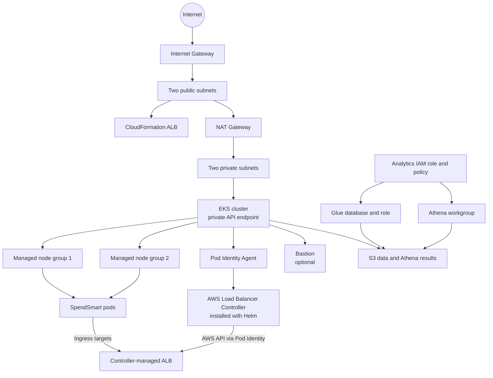

# SpendSmart CloudFormation Architecture

## Purpose and Ownership

The modular CloudFormation root stack provisions AWS infrastructure through nested templates under `modules/`. Kubernetes and Helm manage the application runtime and AWS Load Balancer Controller workload.

CloudFormation provisions the ALB security group, load balancer, listener, and target group. The controller role and Pod Identity association are also provisioned; install the controller workload separately.

## Module Layout

| Template | Resources |
| --- | --- |
| `modules/network-skeleton/template.yaml` | VPC, subnets, internet gateway, routes, one NAT gateway/EIP |
| `modules/bastion/template.yaml` | Optional bastion security group, EC2 instance, and EIP |
| `modules/eks/template.yaml` | EKS cluster, node groups, IAM roles, node/ALB security groups, ALB, and controller identity |
| `modules/s3/template.yaml` | Data and Athena-results bucket |
| `modules/glue/template.yaml` | Glue database and service role |
| `modules/athena/template.yaml` | Athena workgroup |
| `modules/iam/template.yaml` | Analytics role and policy |

`main.yml` is the deployment entrypoint. Run `aws cloudformation package` to upload the child templates and generate the deployable parent template. `template.yaml` is retained as the monolithic reference.

## Architecture

### CloudFormation-managed resources

- Network: VPC, two public and two private subnets, internet gateway, public routing, one NAT gateway/EIP, and shared private routing.
- Access: optional bastion security group, EC2 instance, and optional Elastic IP.
- EKS: cluster, cluster/node roles, launch template, worker security group, two managed node groups, and the `vpc-cni`, `kube-proxy`, `coredns`, and `eks-pod-identity-agent` add-ons.
- Load balancing: ALB security group, application load balancer, listener, and target group.
- Controller identity: IAM role with the AWS Load Balancer Controller permissions policy and an EKS Pod Identity association for the configured Kubernetes namespace/service account.
- Data and analytics: retained S3 bucket, Glue database/role, Athena workgroup, and analytics IAM role/managed policy.

### Helm/Kubernetes-managed resources

- AWS Load Balancer Controller Deployment and service account. Install the chart version matching `AlbControllerVersion`; configure the chart to use `AlbControllerNamespace` and `AlbControllerServiceAccountName`. Pod Identity supplies AWS credentials; do not put access keys in chart values or Kubernetes Secrets.
- SpendSmart Deployment, Service, and Ingress from the application chart.
- Kubernetes Ingress and application target registration, according to the installed controller configuration.

Use an Ingress with `ingressClassName: alb`. The `ip` target mode registers pod IPs (normally preferred with the Amazon VPC CNI); `instance` mode registers worker instances and requires the backend Service to expose a NodePort. Configure health-check path, listener ports, scheme, and certificate for the application.

## ALB Responsibilities

CloudFormation creates the stack ALB, listener, target group, and ALB security group. The AWS Load Balancer Controller has separate ownership of ALBs requested by Kubernetes Ingress resources; it creates and reconciles those Ingress-managed resources and their targets. Do not assume the controller-managed Ingress ALB is the same resource as the stack ALB.

## CloudFormation Outputs

CloudFormation outputs are strings. Values representing Terraform maps/lists are JSON-encoded strings; conditional bastion outputs are absent when `BastionEnabled` is false.

| Output key | Value |
| --- | --- |
| `VpcId` | VPC ID |
| `VpcCidr` | VPC CIDR |
| `PublicSubnetIds` | JSON object mapping AZ names to public subnet IDs |
| `PrivateSubnetIds` | JSON object mapping AZ names to private subnet IDs |
| `NatGatewayIds` | JSON object mapping AZ names to NAT IDs; `{}` when NAT is disabled |
| `InternetGatewayId` | Internet gateway ID |
| `BastionInstanceId` | Bastion instance ID, when enabled |
| `BastionSecurityGroupId` | Bastion security group ID, when enabled |
| `SshKeyPairName` | Existing EC2 key-pair name |
| `BastionPublicIp` | Bastion public IP, when enabled |
| `EksClusterName` | EKS cluster name |
| `EksClusterEndpoint` | EKS API endpoint |
| `EksClusterArn` | EKS cluster ARN |
| `EksClusterSecurityGroupId` | EKS cluster security group ID |
| `EksNodesSecurityGroupId` | Additional worker-node security group ID |
| `EksNodeGroupNames` | JSON array of managed node-group names |
| `EksConfigureKubectl` | `aws eks update-kubeconfig` command |
| `AlbDnsName` | DNS name of the CloudFormation-managed ALB |
| `AlbTargetGroupArn` | ARN of the CloudFormation-managed target group |
| `AlbSecurityGroupId` | Security group ID attached to the CloudFormation-managed ALB |
| `AlbControllerRoleArn` | Controller IAM role ARN for Pod Identity |
| `AlbControllerNamespace` | Controller namespace configured for the association |
| `AlbControllerServiceAccountName` | Controller service-account name configured for the association |
| `AlbControllerVersion` | Controller release to align with the IAM policy and Helm chart |
| `BucketName` | S3 bucket name |
| `DataLocation` | S3 URI for the data prefix |
| `AthenaOutputLocation` | S3 URI for Athena query results |
| `GlueDatabaseName` | Glue database name |
| `GlueRoleArn` | Glue service role ARN |
| `AthenaWorkgroupName` | Athena workgroup name |
| `AnalyticsIamRoleName` | Analytics IAM role name |
| `AnalyticsIamRoleArn` | Analytics IAM role ARN |
| `AnalyticsIamPolicyName` | Analytics IAM managed policy name |
| `AnalyticsIamPolicyArn` | Analytics IAM managed policy ARN |

The stack-created ALB is independent of any additional ALB the controller may provision for an Ingress. The stack exports `AlbDnsName`, `AlbTargetGroupArn`, and `AlbSecurityGroupId` for its ALB resources.

## Resource Lifecycle

1. Deploy the CloudFormation stack. The Pod Identity association and agent are created with the EKS foundation.
2. Configure kubectl from `EksConfigureKubectl` on a host with network access to the private EKS API endpoint.
3. Install the AWS Load Balancer Controller chart using the stack's controller namespace, service-account name, role ARN, and version outputs.
4. Install the SpendSmart chart with an Ingress configured for the controller.
5. Verify the controller Deployment, Ingress address, and target health. Delete the Ingress/application before removing the controller or EKS stack so controller-managed load balancers can be cleaned up.
